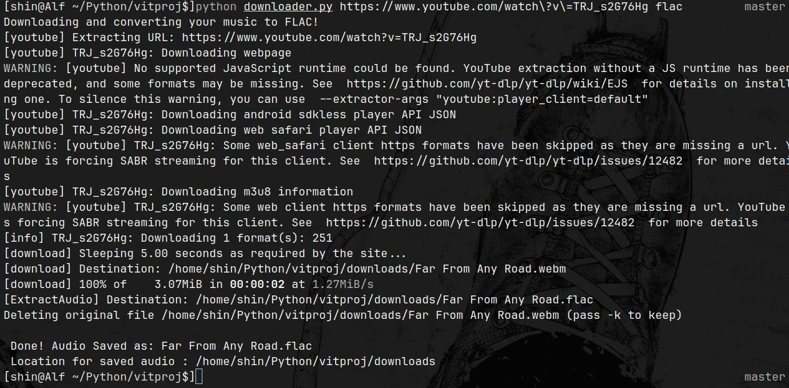

#Youtube Link to audio

<html>
  <h2 align="center">
    
  </h2>

  <h3 align="center">

  A terminal based project to convert your youtube links to audio formats, especially useful for those times when you go offline
    
  </h3>
  <h3>
    Never worry about searching for a website either as it is built it, just clone and use, no waiting for ads for waitlists and ligtning fast as well !!!
  </h3>
</html>


## Tips to keep in mind

* This python file can be stored anywhere and please follow the **instructions** carefully and install the **requirements** as well
* **Extremely lightweight and low footprint** as well
* Works on all platform **Windows**, **linux** and yes **Mac !!** too
* All you need to have is the **lastest version python install** and a **stable internet**

## Steps

* **Step 1**
  Open your terminal and paste this
  ```bash
  git clone https://github.com/profz/VITyarthi-project-link-to-music
  ```

* **Step 2**
  this will save this project in your pc locally

  next run

  ```bash
  pip install yt-dlp
  ```
  make sure to have python install and pip active

* **Step 3**

  ```bash
  python downloader.py
  ```
  this will give you the usage and the tips to run the program

  The audio will be saved in a downloads folder created in the same directory as the program

  ## Have fun using the program hassle free


  **here are some images to help you**

  
